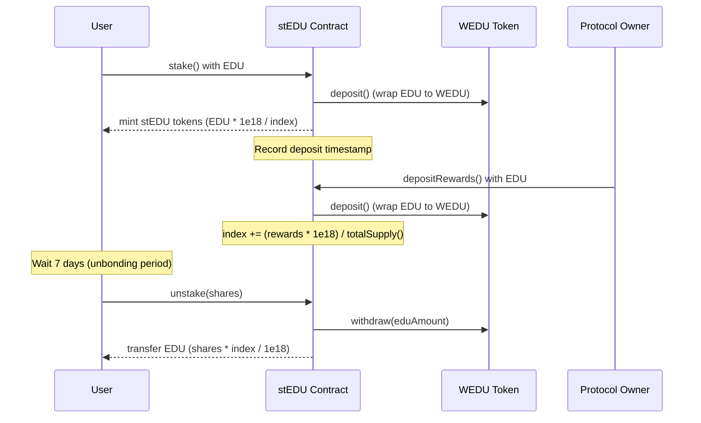

# stEDU: Fixed-balance, Index-accruing Wrapper for Native EDU

This repository contains the smart contracts for `stEDU`, a liquid staking token for EDUCHAIN that uses an index-based reward system with a per-deposit unbonding period.

## Key Features

- **Fixed Balance, Index-Accruing**: Balances never rebase; instead, the `index` (share-price) increases when rewards are pushed
- **Per-deposit Unbonding Period**: Each individual stake is locked for 7 days to prevent front-running and flash loan attacks
- **ERC4626 Compliant**: Implements the ERC4626 Tokenized Vault Standard for better composability
- **Surplus Sync Mechanism**: `sync()` function lets anyone fold accidental WEDU donations into the index

## Deployed Contracts

The contracts have been successfully deployed to the opencampus network:

- **stEDU**: [0x54565fFBd8e6c5b6AF4bbaFDB544Afb915CB58D9](https://edu-chain-testnet.blockscout.com/address/0x54565fFBd8e6c5b6AF4bbaFDB544Afb915CB58D9)
- **wstEDU**: [0x4D94109fA2fFb73f299505053A5bC03Fc3cB6547](https://edu-chain-testnet.blockscout.com/address/0x4D94109fA2fFb73f299505053A5bC03Fc3cB6547)


## How It Works

### Staking and Rewards

1. Users stake native EDU and receive stEDU tokens
2. Each deposit is timestamped and tracked individually
3. When rewards are added, the global `index` increases
4. The value of each stEDU token grows over time as rewards accumulate
5. Users can only unstake after the unbonding period (7 days) has passed for each deposit

### Security Features

- **Unbonding Period**: Prevents front-running attacks and flash loan exploits
- **ReentrancyGuard**: Protects against reentrancy attacks during unstaking
- **Pausable**: Allows emergency pausing of all operations
- **FIFO Unstaking**: Enforces first-in-first-out unstaking order based on deposit timestamps

## Flow Diagram



## Index Mechanism

The index mechanism works as follows:

1. Initially, the index starts at `1e18` (1.0 in decimal)
2. When rewards are added, the index increases by: `(rewardAmount * 1e18) / totalSupply`
3. To convert stEDU to EDU: `stEDUAmount * index / 1e18`
4. To convert EDU to stEDU: `eduAmount * 1e18 / index`

This mechanism ensures that:
- All stakers receive rewards proportional to their stake
- The value of stEDU increases over time without changing balances
- Rewards are automatically compounded


## Build and Deploy

1. Compile:
   ```bash
   npx hardhat compile
   ```

2. Run tests:
   ```bash
   # Run all tests
   npm test
   
   # Run specific test suites
   npm run test:basic
   npm run test:staking
   npm run test:rewards
   npm run test:attack
   npm run test:integration
   ```

3. Deploy stEDU:
   ```js
   // Deploy WEDU first (or use existing WEDU contract)
   const WEDU = await ethers.getContractFactory("WEDU");
   const wedu = await WEDU.deploy();
   
   // Deploy stEDU with WEDU address
   const StEDU = await ethers.getContractFactory("stEDU");
   const stEDU = await StEDU.deploy(await wedu.getAddress());
   ```

4. Interact with the contract:
   ```js
   // Stake EDU
   await stEDU.stake({ value: ethers.parseEther("10") });
   
   // Check stEDU balance
   const stEDUBalance = await stEDU.balanceOf(myAddress);
   
   // Check EDU value
   const eduValue = await stEDU.stEDUToEDU(stEDUBalance);
   
   // Deposit rewards (owner only)
   await stEDU.depositRewards({ value: ethers.parseEther("1") });
   ```
