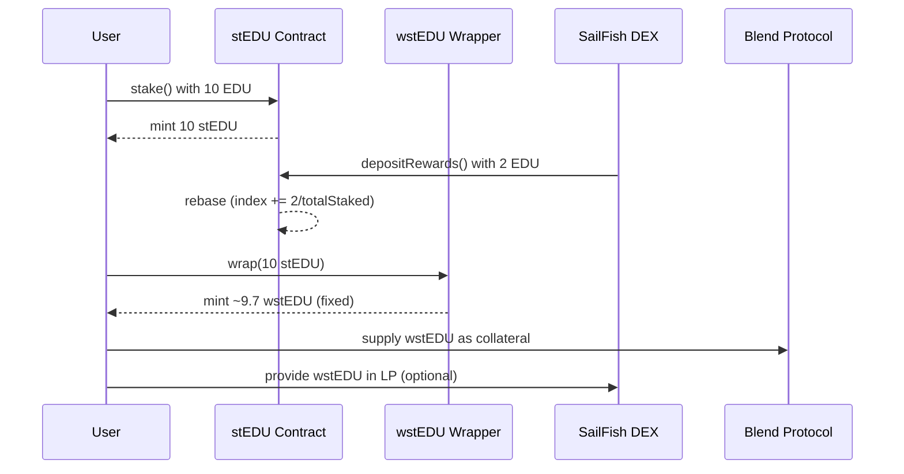

# stEDU & wstEDU on EDUCHAIN

This repo contains the smart contracts for:

- `stEDU`: a **rebasing ERC20 token** that represents staked native $EDU (like stETH)
- `wstEDU`: a **non-rebasing wrapped token** for composability with DeFi protocols (like wstETH)

---

## Purpose

To increase the utility and demand for the native $EDU token on EDUCHAIN through:

- **Auto-compounding staking rewards** distributed from SailFish DEX fees and $SAIL emissions
- **Interoperability** across protocols like **Blend** (lending) and **SailFish** (DEX)

---

## Token Overview

| Token    | Description                              | Balance Behavior      | Use Cases                              |
|----------|------------------------------------------|------------------------|----------------------------------------|
| `stEDU`  | Rebasing token representing staked $EDU  | Grows in balance daily | Wallet display, wrapping, unstaking    |
| `wstEDU` | Wrapped non-rebasing version of stEDU    | Fixed balance, value grows | Blend Lending, LPs, integrations   |

---

## How It Works

- Users stake native $EDU to receive `stEDU`
- Rewards are deposited manually by protocol owner (e.g., SailFish)
- Each reward deposit triggers a **rebase**, updating the global `index`
- Users can wrap `stEDU` into `wstEDU` for use in DeFi protocols like Blend

---

## Example Flow



---

## Leverage Loop Strategy with Blend + SailFish

By combining `wstEDU`, the Blend Lending Protocol, and SailFish DEX, users can **loop stake and borrow to amplify exposure** and rewards.

### Example Recursive Strategy

1. **Stake native $EDU** → receive `stEDU`
2. **Wrap `stEDU` to `wstEDU`** for DeFi usage
3. **Deposit `wstEDU` into Blend** as collateral
4. **Borrow more $EDU** from Blend
5. **Repeat**: Stake borrowed $EDU → get more `stEDU` → wrap → deposit again

### Why This Works

- `wstEDU` **grows in value** (index-based auto-compounding)
- Users earn **staking yield** + potential **DEX incentives** + **Blend lending APR**

### Important Considerations

- Blend must **accept `wstEDU` as collateral**
- Watch for **liquidation risks** as EDU price fluctuates
- Ensure **accurate Oracle pricing** for `wstEDU`

---

## Contract Roles

- **Owner** (SailFish DAO):
  - Can deposit rewards (in native EDU)
  - Can withdraw emergency funds
- **Users**:
  - Can stake/unstake $EDU
  - Can delegate voting (if integrated with governance)
  - Can wrap/unwrap to use in DeFi

---

## APY Formula (Auto-Compounded)

```text
APY = ((index_now / index_start) ^ (365 / days_elapsed) - 1) * 100%
```

This gives the effective **annual yield**, assuming rewards are compounded into the `index`.

---

## Build

1. Compile:
   ```bash
   npx hardhat compile
   ```

2. Deploy stEDU:
   ```js
   const stEDU = await ethers.deployContract("stEDU");
   ```

3. Deploy wstEDU:
   ```js
   const wstEDU = await ethers.deployContract("wstEDU", [stEDU.address]);
   ```

4. Stake, wrap, and test rebase logic via:
   ```bash
   npx hardhat console
   ```


## Inspiration: stETH vs wstETH

|            | stEDU          | wstEDU             |
|------------|----------------|--------------------|
| Like       | stETH          | wstETH             |
| Behavior   | Rebase (balance grows) | Value grows (index) |
| Use        | Wallets, UX    | DeFi protocols     |
